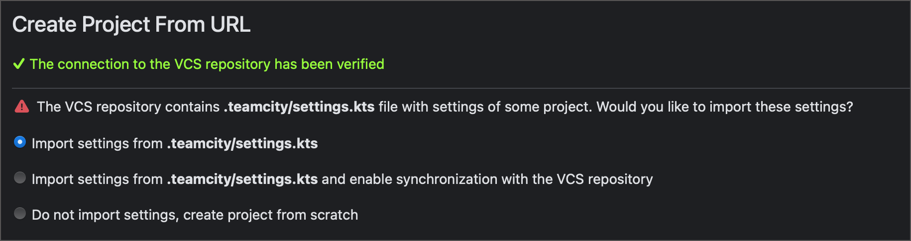

# Maven Configuration (TeamCity Samples)

This is a sample Java project for TeamCity.

Tutorials that use this project:

* [Configure and run your first build (TC On-Premises)](https://www.jetbrains.com/help/teamcity/configure-and-run-your-first-build.html)
* [Configure and run your first build (TC Cloud)](https://www.jetbrains.com/help/teamcity/cloud/configure-and-run-your-first-build.html)

## Dependencies and Requirements

* Java 11
* Maven 3.8.0
* JUnit 3.8.1

## Overview

This is a sample Java application managed by Maven. The project includes two classes:

* `App.java` — the main "Hello world" application.
* `AppTest.java` — the test suite with one Unit test (always finishes successfully).

Versioned settings stored in the `.teamcity` folder generate a TeamCity project with a configuration that runs a single `clean test` command inside a Maven step. See the tutorials mentioned above for more information.

## Using Versioned Settings

The `.teamcity` folder stores project settings in the [Kotlin DSL](https://www.jetbrains.com/help/teamcity/kotlin-dsl.html) format. When you create a new project from this sample repository, TeamCity detects these settings and presents you with the following options:

* Import settings — automatically configure the TeamCity project using remote settings. Settings are applied only once, allowing you to freely modify the project afterward.

* Import settings and enable synchornization — set up the TeamCity project with remote settings and establish two-way sync. Changes you make will be committed back to the VCS, and you can also edit the `.kts` file in the remote repo to modify the project.

* Do not import settings — start with a blank project targeting this repository.

Choose option #1 or option #3 depending on a tutorial. Some tutorials guide you to manually configure a blank project, while others recommend importing initial settings to kick-start your setup.

Opt for option #2 only if your project targets a forked sample and TeamCity has write permissions to it. Without these permissions, TeamCity won’t be able to push updates, causing the UI to lock and preventing further edits to the project.

## Other Samples

* [Gradle/Docker pipeline](https://github.com/JetBrains/Gradle-Docker-Pipeline-TeamCity-Samples)
